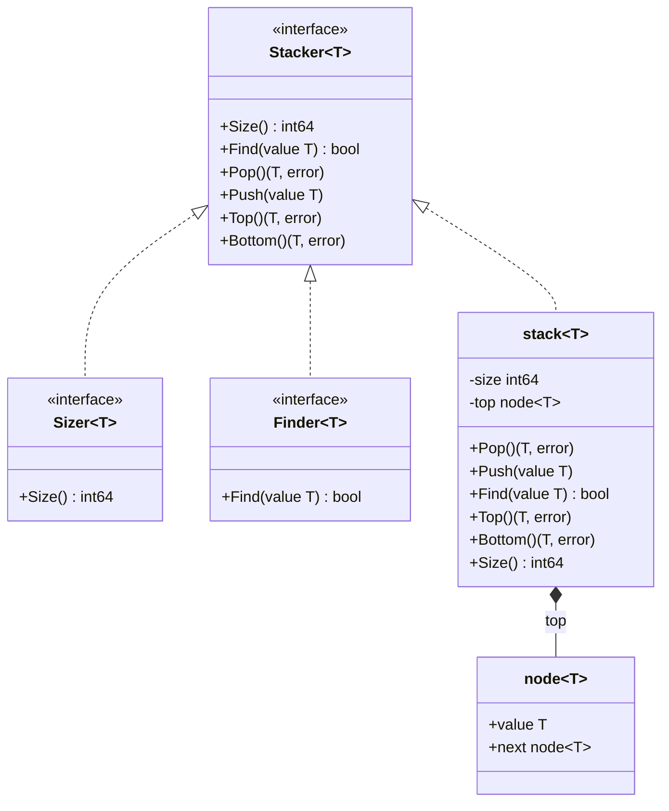
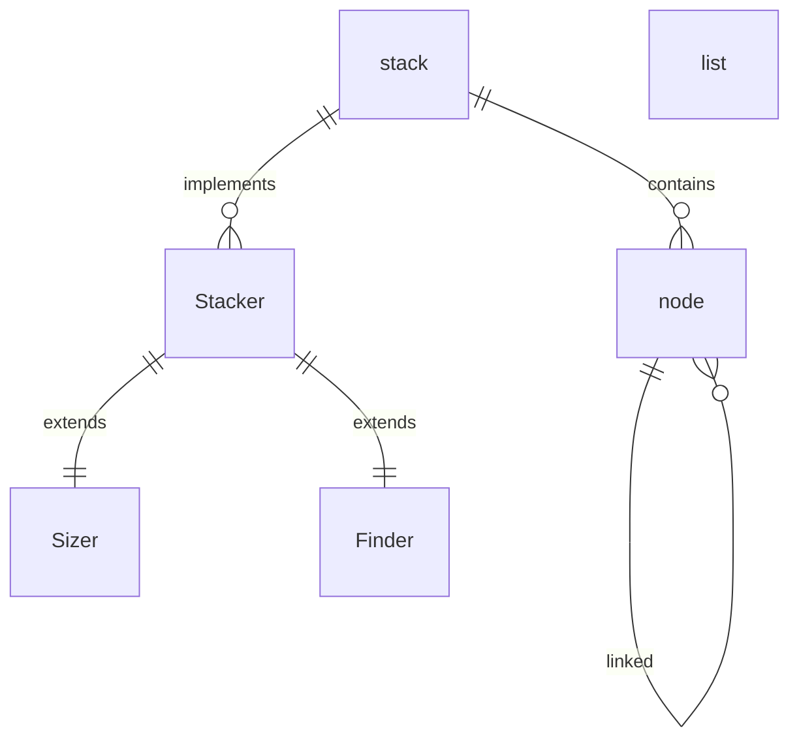

# Data Structures - Class Diagrams

## Stack Implementation

## Relationships Overview

## Implementation Details

### Interfaces

- **`Stacker[T]`**: Main interface for stack operations
  - Extends `Sizer[T]` and `Finder[T]`
  - Provides core stack functionality: Push, Pop, Top, Bottom

- **`Sizer[T]`**: Interface for size operations
  - Single method: `Size() int64`

- **`Finder[T]`**: Interface for search operations
  - Single method: `Find(value T) bool`

### Concrete Types

- **`stack[T]`**: Generic stack implementation
  - Uses linked list internally
  - Type constraint: `T comparable`
  - Private implementation (lowercase name)

- **`node[T]`**: Linked list node
  - Generic type with value and next pointer
  - Forms the underlying data structure

### Key Design Patterns

1. **Interface Segregation**: Separate interfaces for different concerns
2. **Generic Programming**: Type-safe implementation with constraints
3. **Encapsulation**: Private implementation with public interface
4. **Linked List**: Efficient O(1) push/pop operations

## Type Constraints

All generic types use the constraint `T comparable` to enable:
- Equality comparisons in `Find()` method
- Proper type safety
- Zero value handling
